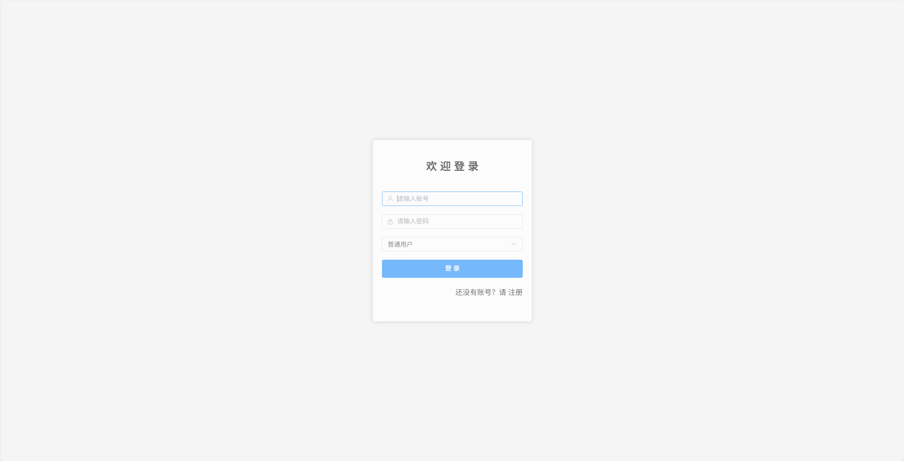
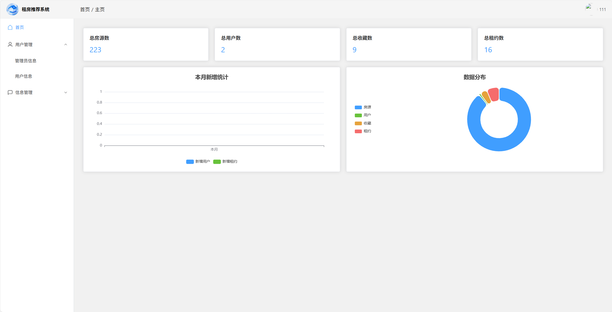
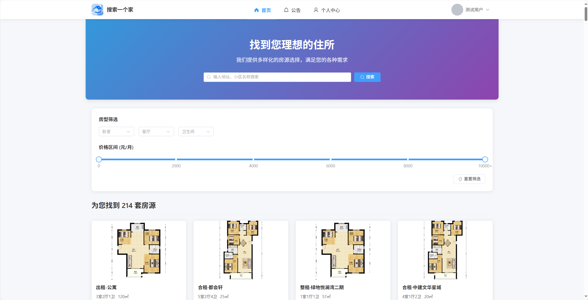

# 🏠 租房管理系统

<div align="center">


一个基于Spring Boot + Vue的租房管理系统，提供房源管理、用户管理、租约管理等功能。

[功能特性](#功能特性) • [技术栈](#技术栈) • [快速开始](#快速开始) • [项目结构](#项目结构)

</div>

## 📸 系统预览

<div align="center">
  
  <p>系统仪表盘 - 数据概览</p>


  
  <p>房源管理 - 列表展示</p>

  
  <p>房源详情 - 信息展示</p>
</div>

## ✨ 功能特性

### 👨‍💼 管理员功能
- 📊 管理员账号管理
- 👥 用户管理
- 🏘️ 房源管理
- 📝 租约管理
- 📢 公告管理
- 📈 系统监控

### 👤 用户功能
- 🔐 用户注册/登录
- 👤 个人信息管理
- 🔍 房源浏览和搜索
- ⭐ 收藏房源
- 📅 在线预约看房
- 📋 租约管理

## 🛠️ 技术栈

### 后端
- Spring Boot 3.x
- MyBatis
- MySQL 8.0
- JWT认证
- Maven

### 前端
- Vue 3
- Element Plus
- Axios
- Vue Router
- Pinia

## 📁 项目结构
```
├── SpringBoot/                # 后端项目
│   ├── src/
│   │   ├── main/
│   │   │   ├── java/        # Java源代码
│   │   │   └── resources/   # 配置文件
│   │   └── test/            # 测试代码
│   └── pom.xml              # Maven配置
│
└── vue/                      # 前端项目
    ├── src/
    │   ├── assets/          # 静态资源
    │   ├── components/      # 组件
    │   ├── views/           # 页面
    │   ├── router/          # 路由配置
    │   └── utils/           # 工具类
    └── package.json         # 依赖配置
```

## 🚀 快速开始

### 环境要求

- ⚡ JDK 17+
- 📦 Node.js 16+
- 🐬 MySQL 8.0+
- 🏗️ Maven 3.6+

### 后端部署
1. 创建数据库
```sql
CREATE DATABASE house DEFAULT CHARACTER SET utf8mb4 COLLATE utf8mb4_unicode_ci;
```

2. 修改配置
复制`application.properties.example`为`application.properties`，修改数据库连接信息：
```properties
spring.datasource.url=jdbc:mysql://localhost:3306/house?serverTimezone=Asia/Shanghai
spring.datasource.username=your_username
spring.datasource.password=your_password
```

3. 运行项目
```bash
cd SpringBoot
mvn spring-boot:run
```

### 前端部署
1. 安装依赖
```bash
cd vue
npm install
```

2. 开发环境运行
```bash
npm run dev
```

3. 生产环境构建
```bash
npm run build
```

## 🔑 默认账号

### 管理员账号
- 账号：`admin`
- 密码：`admin`

### 测试用户账号
- 账号：`user`
- 密码：`user`

## ⚠️ 注意事项

### 1. 配置文件
- 生产环境部署时，请修改`application.properties`中的敏感信息
- 确保数据库密码等敏感信息的安全性

### 2. 文件上传
- 系统默认将上传文件存储在`/SpringBoot/src/main/resources/static/files/`目录
- 生产环境建议配置专门的文件存储服务

### 3. 安全建议
- 定期修改默认密码
- 及时更新系统依赖
- 配置适当的访问权限

## 👨‍💻 关于作者

- 作者：A-Dream-ZX
- 项目：个人开发项目
- 邮箱：Dream_0xFF@outlook.com


## 📄 许可证

本项目采用 MIT 许可证 - 详见 [LICENSE](LICENSE) 文件

## ⚠️ 免责声明

本项目仅供学习和研究使用，不得用于商业用途。使用本项目所产生的任何后果由使用者自行承担。

### 📚 论文参考

本项目相关的论文参考文档位于 `docs/papers/` 目录下，仅供学术研究参考。如需引用，请注明出处。

### 🔒 数据安全

- 本项目使用的所有数据均为示例数据
- 请勿在生产环境中使用默认账号和密码
- 建议定期备份重要数据
- 请遵守相关法律法规使用本系统

---

<div align="center">
  <sub>Built with ❤️ by A-Dream-ZX</sub>
</div>
